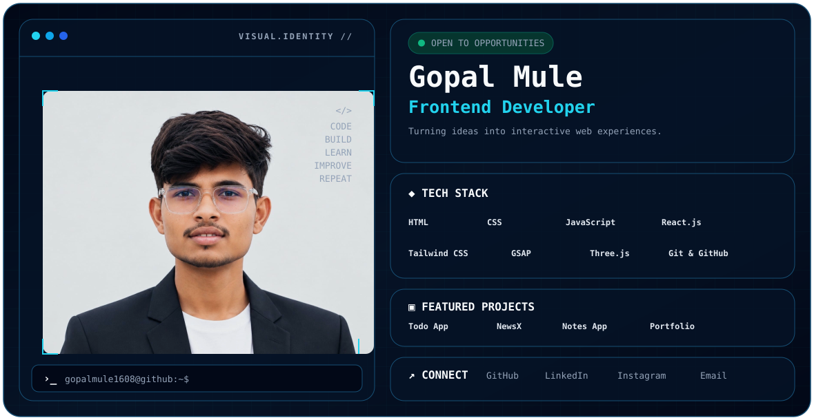

<p align="center">
  
</p>

<h1 align="center">Hi 👋, I'm Gopal Mule</h1>

<h3 align="center">Frontend Developer | BCA Science Student | Future Full Stack Developer</h3>

<p align="center">
  <a href="https://github.com/gopalmule1608">
    
  </a>
  <a href="https://linkedin.com/in/gopal-mule-ba89233b1">
    
  </a>
  <a href="https://instagram.com/gopal.mule.1608">
    
  </a>
</p>

---

## 👨‍💻 About Me

I'm a BCA Science student and a passionate Frontend Developer who enjoys building modern, responsive, interactive, and user-friendly web experiences.

I started my development journey with HTML, CSS, and JavaScript and gradually moved into modern frontend technologies such as React.js, Tailwind CSS, GSAP, and Three.js.

Currently, I'm improving my frontend skills while also exploring backend development and the MERN stack.

My long-term goal is to become a **Full Stack Developer** and build real-world products that solve practical problems.

---

## 🎓 Education

**Bachelor of Computer Applications (BCA Science)**

- University: BAMU University
- College: Shivchhatrapati College, Chhatrapati Sambhajinagar
- Current Year: 3rd Year
- Current Semester: 5th Semester
- CGPA: 9.0

---

## 🛠️ Tech Stack

### Frontend

<p>
  
  
  
  
  
</p>

### Animation & 3D

<p>
  
  
</p>

### Tools

<p>
  
  
</p>

---

## 🚀 What I'm Currently Learning

- React.js
- Advanced JavaScript
- Tailwind CSS
- GSAP
- Three.js
- Backend Development
- Node.js
- Express.js
- MongoDB
- REST APIs
- MERN Stack

---

## 📌 Featured Projects

### 📝 Notes App

A notes and learning platform with course-based content, search, filtering, downloads, and dark mode.

### 📰 NewsX

A news application that fetches and displays current news using an API.

### ✅ Todo App

A simple productivity application for creating, managing, and completing tasks.

### 🎨 Portfolio

A modern personal portfolio focused on responsive design, animations, and interactive user experiences.

---

## 💡 My Development Focus

```text
Frontend Development
        ↓
Modern UI / UX
        ↓
Responsive Web Design
        ↓
Animations & Interactions
        ↓
React Development
        ↓
Backend & APIs
        ↓
Full Stack Development
